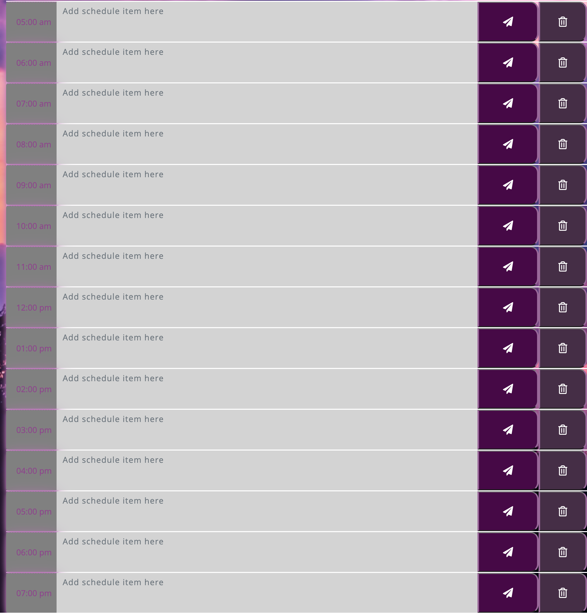
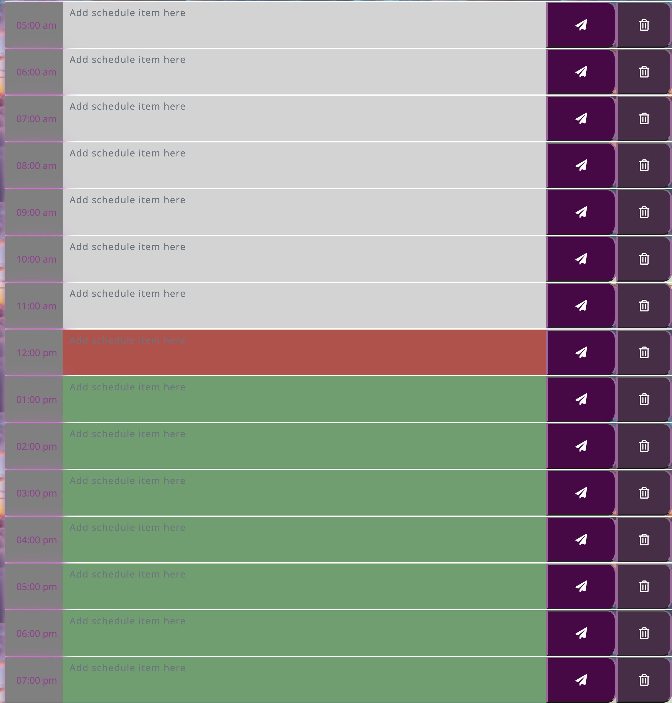
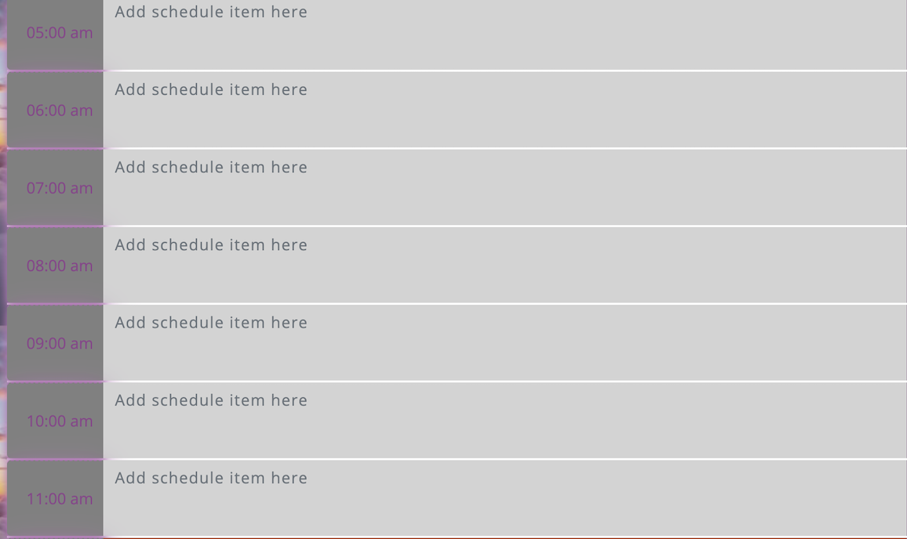
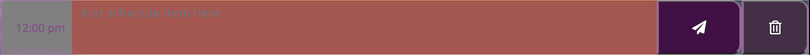
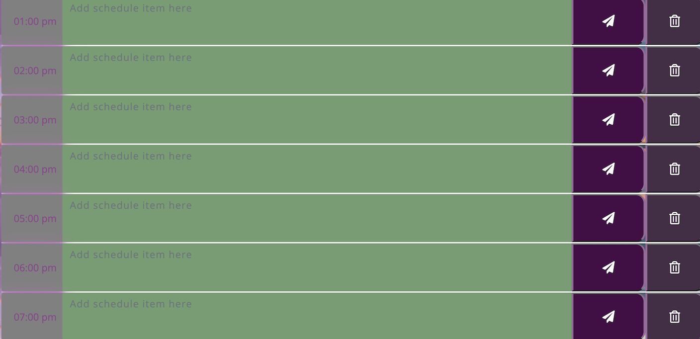
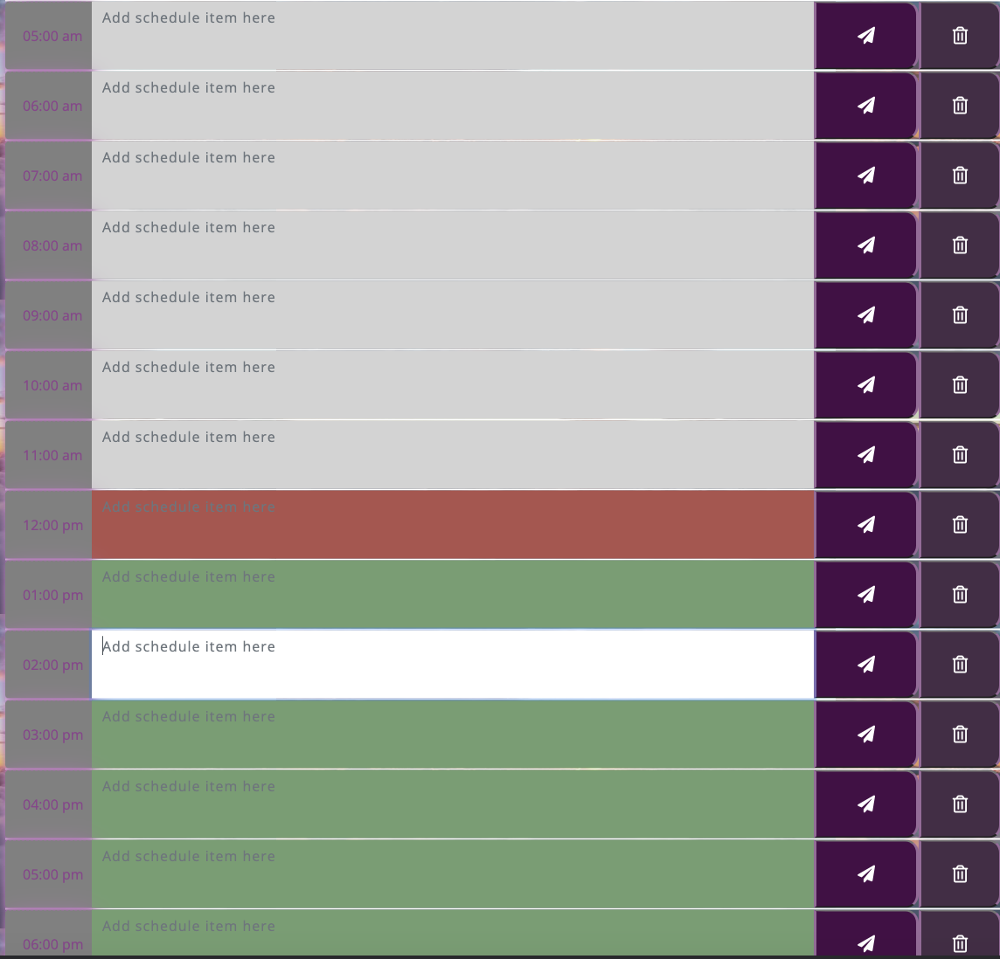
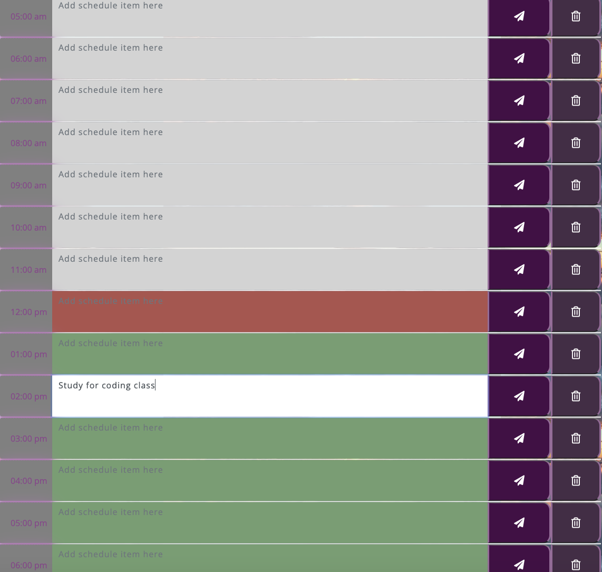
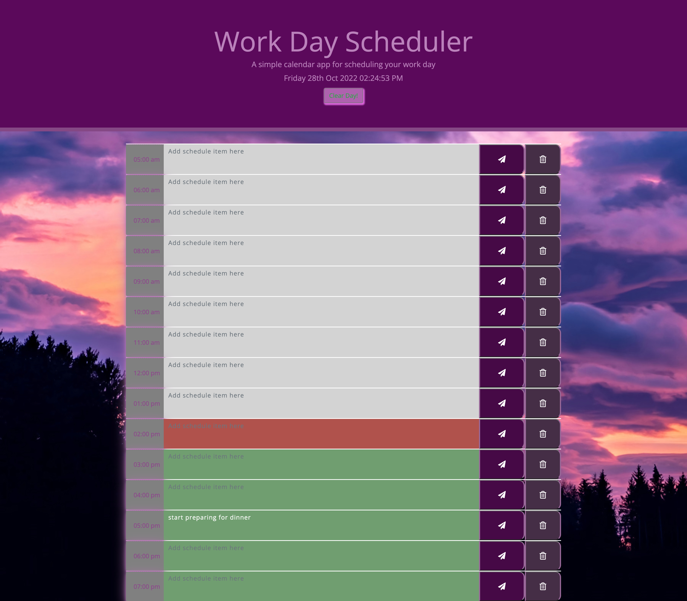
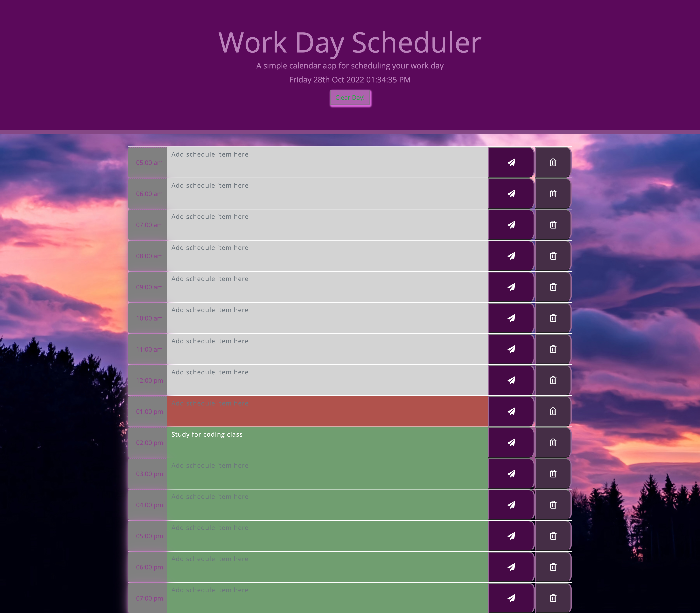

# Third-Party-APIs-Challenge-Work-Day-Scheduler
Homework Challenge #5

## Project Description

For this assignment we had to create a work day scheduler. We had to make sure that there are timeblocks for the day and that the time, day, and date shows at the top. We had to make sure that the time blocks show the past, present, and future. The past shows as gray, present as red, and future shows as green. When the user clicks on the time slot it would turn white then they would write their schedule for the timeslot(s). When they click out of it it would go back to gray then the user would have to save. When the user clicks refresh then their schedule for the timeslot(s) would persist. They can also click on clear day to completely clear out their schedule for the day. I had also added extra hours to the day just in case the user has meetings and other work related schedules before 9AM. I had also added a delete button to make it easier for the user just in case they had accidentally added the schedule for the wrong time or if there was a cancellation or change in time for the original schedule time. My live page can be seen in the <a href="#Table of Contents">Table of Contents</a> section.JS Code was created by me. The HTML and CSS codes were all already provided by UCSD Coding Bootcamp. They had already added a media query to make it user friendly for those who choose to use the "replace with correct deployed application" on either a mobile and/or tablet. You can <a href=hhttps://github.com/hannybear88/Third-Party-APIs-Challenge-Work-Day-Scheduler/>Click here</a> to see my code for this project. 

## Table of Contents
<nav>
    <ol>
        <li><a href="#Installation">Installation</a></li>
        <li><a href="User Story">User Story</a></li>
         <li><a href="#How to Use this Project and Acceptance Criteria">How to Use this Project and Acceptance Criteria</a></li>
          <li><a href="#Challenges">Challenges</a></li>
        <li><a href="#Success">Success</a></li>
         <li><a href="Demo">Demo</a></li>
          <li><a href="#Features">Features</a></li>
        <li><a href="#Support">Support</a></li>
        <li><a href="#Credits">Credits</a></li>
        <li><a href="#Contributors">Contributors</a></li>
    </ol>
</nav>

## Installation

Installation is not required, unless you plan on cloning to refactor the code. Please <a href="mailto:hannahkchung88@gmail.com">email me</a> to make sure this is okay. 

## User Story

AS AN employee with a busy schedule
I WANT to add important events to a daily planner
SO THAT I can manage my time effectively

## How to Use the Project and Acceptance Criteria

<a href=https://hannybear88.github.io/Third-Party-APIs-Challenge-Work-Day-Scheduler/>Click here</a> to be directed straight to the deployed application

GIVEN I am using a daily planner to create a schedule
WHEN I open the planner
<!-- THEN the current day is displayed at the top of the calendar -->

WHEN I scroll down
THEN I am presented with time blocks for standard business hours

WHEN I view the time blocks for that day
THEN each time block is color-coded to indicate whether it is in the past, present, or future

Past = GRAY

present = RED

Future = GREEN

WHEN I click into a time block

THEN I can enter an event

WHEN I click the save button for that time block

THEN the text for that event is saved in local storage

WHEN I refresh the page
THEN the saved events persist

## Challenges
This assignment was a challenging. I'm not used to using JQuery, Moment.js, and Bootstrap. It is definitely easier than Vanilla Javascript. Even though this assignment was challenging, it was quite enjoyable because I do like having a planner and writing things down that I need to do and plans and future events, so that I don't forget and I don't double book on making plans or make plans on a day I have an event I am attending. I'd like to eventually challenge myself on this project by adding future dates, so that the user is not limited to one day and waiting til 12:00AM to plan their event for the next day. I'd like for the user to have the freedom by not having a limit on planning their days and events.

## Success
I feel like I did well on this assignment by suceeding on the requirements on the assignment. I had added extra features to challenge myself which I like to do. 

## Demo

WORK DAY SCHEDULER SCREENSHOT

## Features

<ul>
    <li>HTML</li>
    <li>CSS</li>
    <li>JQuery</li>
    <li>Moment.js</li>
    <li>Bootstrap</li>
</ul>

## Support

If you need extra support feel free to <a href="mailto:hannahkchung88@gmail.com">email me</a>

## Credits

<ul>
    <li>Code refactored by Hannah Chung</li>
    <li>index.html and style.css, starter codes provided by UCSD Coding Bootcamp</li>
</ul>

## Contributors

<ul>
    <li>Code refactored by Hannah Chung</li>
    <li>index.html and style.css, and starter codes provided by UCSD Coding Bootcamp</li>
</ul>